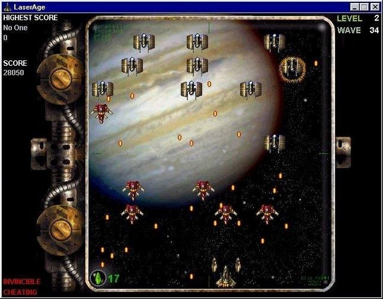

# Laserage bot
A bot that can win the game LaserAge. LaserAge is a 2D space shooter from 1999 which I used to play during my childhood. I decided to make a bot because I've never been able to beat it manually. I've made a Youtube video winning the game for the first time, while also adding the final touches to the code, [link here](https://www.youtube.com/watch?v=UdI1vJwmLKI).

You can download the game from [here](http://www.freegamesarea.com/laserage-gold.html) (I'm not responsible for that website).

# How it works
The bots works by scanning one line of the screen and avoiding the bullets by controlling the computer mouse. It also detects power ups and tries to catch them.
